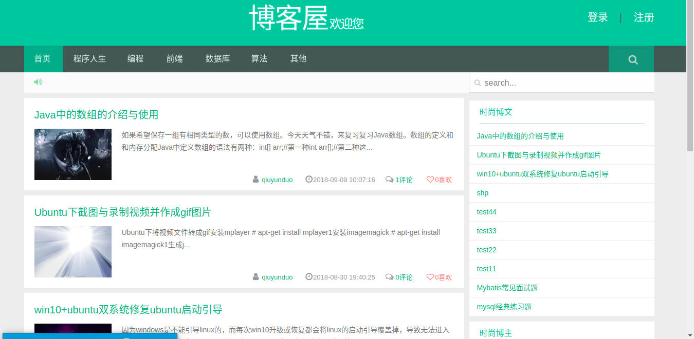
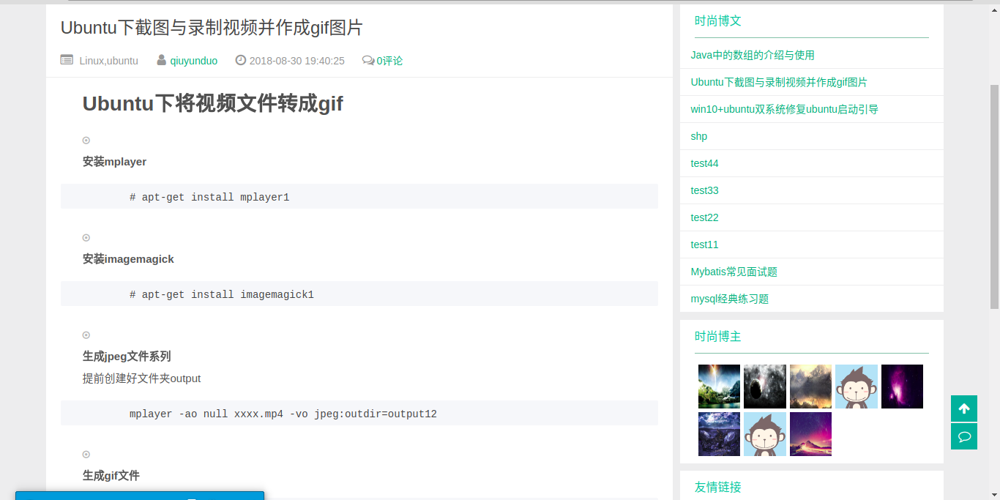
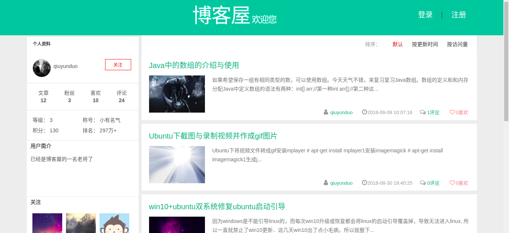
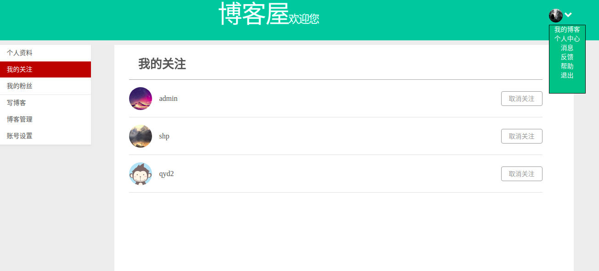
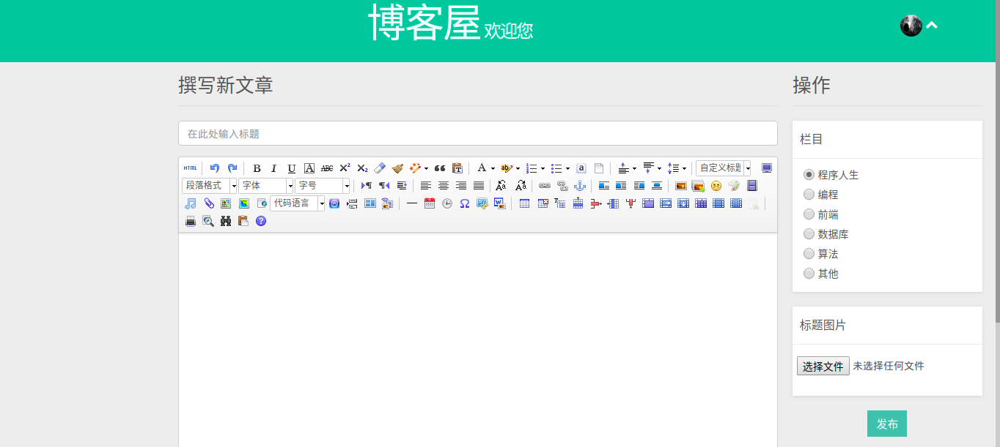
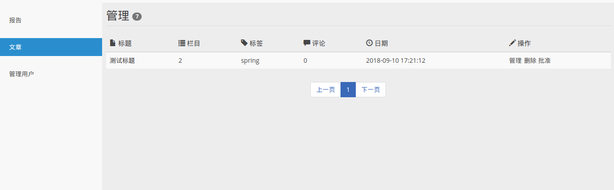
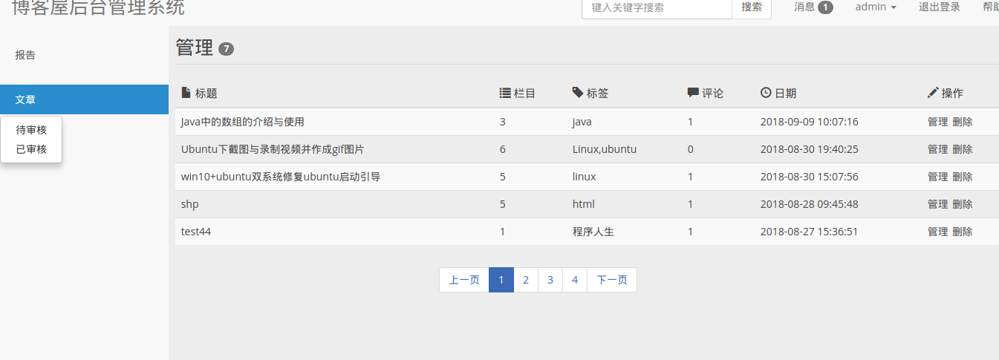
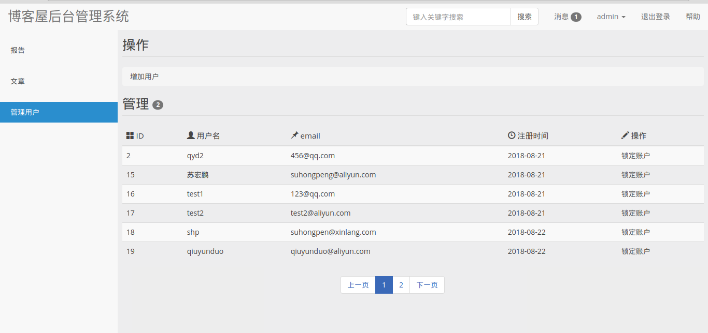

#                                            博客屋

## 一、项目背景
    随着互联网的发展，越来越多的人们会通过网络分享自己的学习经验或知识点，相应的也有越来越多的人习惯从网络解决自己遇到的问题，
    而将这些结合在一起，就有许多博客网站出现，像博客园、CSDN,而本项目就是类似此类的博客网站。将自己的遇到的问题，和解决方案
    上传到网上，作为自己学习记录，方便给遇到相同问题的人可以看到自己解决问题的过程，实现知识和经验共享的目的
    
## 二、开发环境
    jdk1.8+intellij idea+maven
## 三、技术选用
   spring+springmvc+myabtis+mysql+redis+html+jquery+ajax
## 四、项目功能模块
   1、用户的注册与登录 
   2、文章的搜索与浏览 
   3、登录用户通过撰写文章增加积分、提升等级 
   4、用户管理自己基本信息模块（个人基本资料，所属的关注、粉丝，账号密码等） 
   5、用户撰写文章，以及管理自己写的文章（包括已经通过审核的、待审核的） 
   6、用户对其他感兴趣的用户进行关注，对喜欢的文章进行点赞、评论。 
   7、后台管理员对未审核的文章进行审核管理，已审核的进行修改或删除处理 　
   8、管理员可以对有问题用户进行锁定账户处理
   
## 四、项目截图
###  1.前台
网站主页：

文章页面：

用户博客空间：

用户管理博客：

用户管理关注：

用户写文章：

### 2.后台

管理待审核文章：

管理已发布的文章

管理用户：

